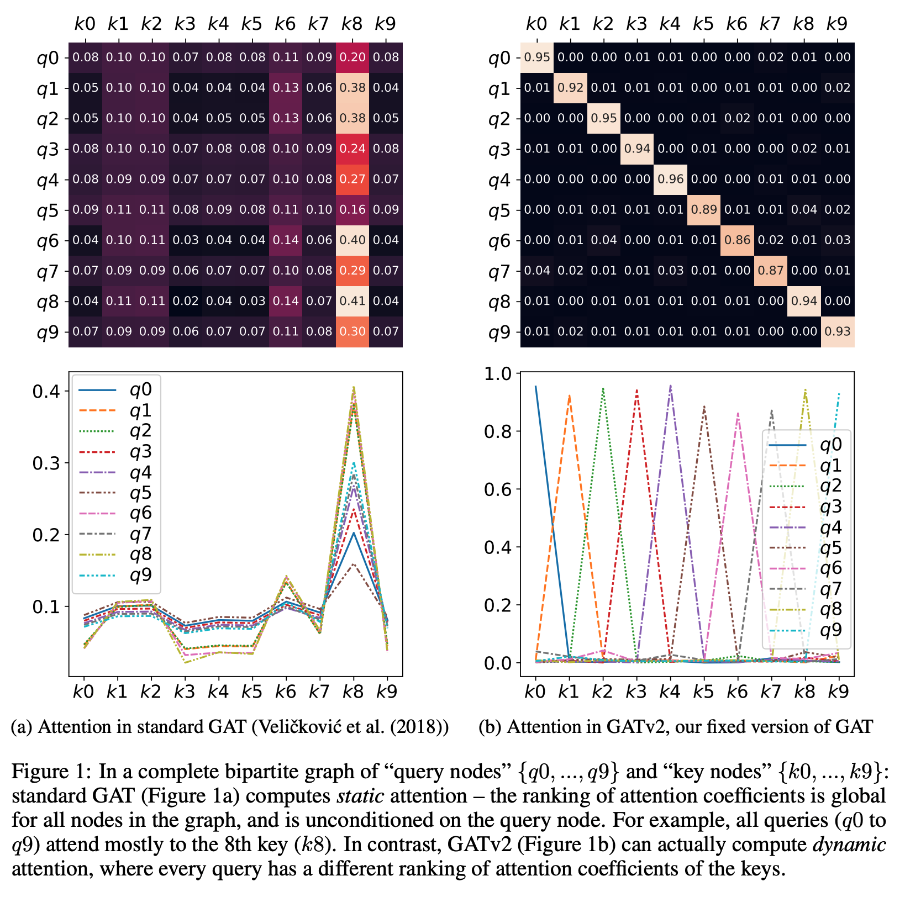

# How Attentive are Graph Attention Networks?

This repository is the official implementation of [How Attentive are Graph Attention Networks?](https://arxiv.org/pdf/2105.14491.pdf). 



**GATv2 is now available as part of PyTorch Geometric library!** 

[https://pytorch-geometric.readthedocs.io/en/latest/modules/nn.html#torch_geometric.nn.conv.GATv2Conv](https://pytorch-geometric.readthedocs.io/en/latest/modules/nn.html#torch_geometric.nn.conv.GATv2Conv)

and also is [in this main directory](gatv2_conv_PyG.py).

**GATv2 is now available as part of DGL library!** 

[https://docs.dgl.ai/en/latest/api/python/nn.pytorch.html#gatv2conv](https://docs.dgl.ai/en/latest/api/python/nn.pytorch.html#gatv2conv)

and also in [this repository](gatv2_conv_DGL.py).

**GATv2 is now available as part of Google's TensorFlow GNN library!** 

[https://github.com/tensorflow/gnn/blob/main/tensorflow_gnn/docs/api_docs/python/gnn/keras/layers/GATv2.md](https://github.com/tensorflow/gnn/blob/main/tensorflow_gnn/docs/api_docs/python/gnn/keras/layers/GATv2.md)

# DictionaryLookup

The code for reproducing the DictionaryLookup experiments can be found in the [dictionary_lookup](dictionary_lookup/README.md) directory.


The rest of the code for reproducing the experiments in the paper will be made publicly available.

# Citation
[How Attentive are Graph Attention Networks?](https://arxiv.org/pdf/2105.14491.pdf)
```
@article{brody2021attentive,
  title={How Attentive are Graph Attention Networks?},
  author={Brody, Shaked and Alon, Uri and Yahav, Eran},
  journal={arXiv preprint arXiv:2105.14491},
  year={2021}
}
```


