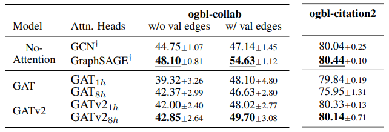
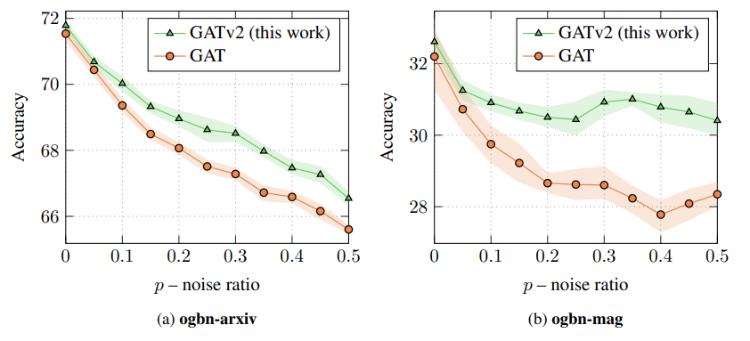

This directory contains all needed scripts and files to reproduce Tables 2a,3 and Figure 4.

## Requirements

### Dependencies
This project is based on PyTorch 1.7.1 and the [pytorch_geometric](https://pytorch-geometric.readthedocs.io/) library.
First, install PyTorch 1.7.1 from the official website: [https://pytorch.org/](https://pytorch.org/).
PyTorch Geometric requires manual installation, and we thus recommend to use the instructions in  [https://pytorch-geometric.readthedocs.io/en/latest/notes/installation.html](https://pytorch-geometric.readthedocs.io/en/latest/notes/installation.html).

The `requirements.txt` lists the additional requirements.

Eventually, run the following to verify that all dependencies are satisfied:
```setup
pip install -r requirements.txt
```

## Reproducing Experiments

1. __ogbn-arxiv__

    Run: `bash run_arxiv.sh`

    Results will be saved in `arxiv_<model>_<num>_heads_results.txt`

2. __ogbn-mag__

    Run: `bash run_mag.sh`

    Results will be saved in `mag_<model>_<num>_heads_results.txt`

3. __ogbn-products__

    Run: `bash run_products.sh`

    Results will be saved in `products_<model>_<num>_heads_results.txt`

4. __Noise__ (__ogbn-arxiv__, __ogbn-mag__)

    Run: `bash run_noise.sh`

    Results will be saved in `<dataset>_noise_<noise_ratio><model>_results.txt`

5. __ogbl-collab__

    Run: `bash run_collab.sh`

    Results for `w/ val edges` will be saved in `collab_with_valedges_<model>_<num>_heads_results.txt`

    Results for `w/o val edges` will be saved in `collab_without_valedges_<model>_<num>_heads_results.txt`

6. __ogbl-citation2__

    Run: `bash run_citation2.sh`

    Results will be saved in `citation2_<model>_<num>_heads_results.txt`

Where:
* `<model>` can be GAT, GAT2 or DPGAT
* `<num>` can be 1 or 8
* `<noise_ratio>` can be 0, 0.05, ..., 0.5

## Results

The results of running the above scripts are:

Table 1a:


Table 3:



Figure 4:


