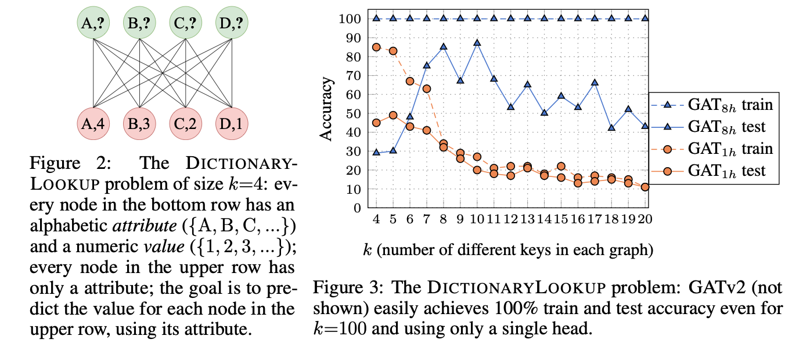

# DictionaryLookup Benchmark

This repository can be used to reproduce the experiments of 
Section 4.1 in the paper, for the "DictionaryLookup" problem. 


# The DictionaryLookup problem


## Requirements

### Dependencies
This project is based on PyTorch 1.7.1 and the [PyTorch Geometric](https://pytorch-geometric.readthedocs.io/) library.
First, install PyTorch from the official website: [https://pytorch.org/](https://pytorch.org/).
PyTorch Geometric requires manual installation, and we thus recommend to use the instructions in  [https://pytorch-geometric.readthedocs.io/en/latest/notes/installation.html](https://pytorch-geometric.readthedocs.io/en/latest/notes/installation.html).

The `requirements.txt` lists the additional requirements.

Eventually, run the following to verify that all dependencies are satisfied:
```setup
pip install -r requirements.txt
```

## Reproducing Experiments

To run a single experiment from the paper, run:

```
python main.py --help
```
And see the available flags.
For example, to train a GATv2 with size=10 and num_heads=1, run:
```
python3 main.py --task DICTIONARY --eval_every 10 --size 10 --num_layers 1 --batch_size 1024 --dim 128 --type GATv2 --stop TEST_NODE --num_heads 1 --save saved_models/gatv2_128_s10.pt
```  

Alternatively, to train a GAT with size=10 and num_heads=8, run:
```
python3 main.py --task DICTIONARY --eval_every 10 --size 10 --num_layers 1 --batch_size 1024 --dim 128 --type GAT --stop TEST_NODE --num_heads 8 --save saved_models/gat_128_s10.pt
```

We already trained such GAT and GATv2 models in `saved_models/`, and Figure 1 of the paper can be reproduced by running:
```
python3 main.py --load saved_models/gatv2_128_s10.pt --plot 0
python3 main.py --load saved_models/gat_128_s10.pt --plot 0
```


## Experiment with other GNN types
To experiment with other GNN types:
* Add the new GNN type to the `GNN_TYPE` enum [here](common.py#L30), for example: `MY_NEW_TYPE = auto()`
* Add another `elif self is GNN_TYPE.MY_NEW_TYPE:` to instantiate the new GNN type object [here](common.py#L57)
* Use the new type as a flag for the `main.py` file:
```
python main.py --type MY_NEW_TYPE ...
```

