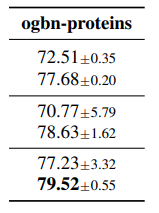

This directory contains the needed script and files to reproduce Table 2b.

## Requirements

### Dependencies
This project is based on PyTorch 1.7.1 and the [DGL](https://www.dgl.ai/) library.
First, install PyTorch 1.7.1 from the official website: [https://pytorch.org/](https://pytorch.org/).
Then, install DGL 0.6.0 from the offical website: [https://www.dgl.ai/pages/start.html](https://www.dgl.ai/pages/start.html).

The `requirements.txt` lists the additional requirements.

Eventually, run the following to verify that all dependencies are satisfied:
```setup
pip install -r requirements.txt
```

## Reproducing Experiments

1. __ogbn-proteins__:

    Run: `bash run_proteins.sh`

    Results will be saved in `proteins_<model>_<num>_heads_results.txt`


Where:
* `<model>` can be GAT, GAT2 or DPGAT
* `<num>` can be 1 or 8
* `<noise_ratio>` can be 0, 0.05, ..., 0.5


## Results

The results of running the above scripts are:

Table 1b:

